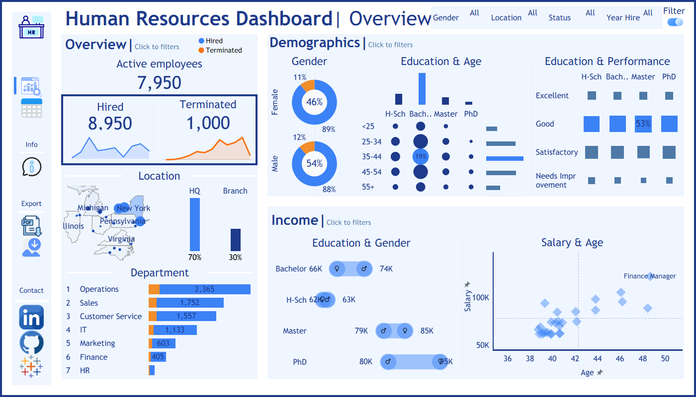
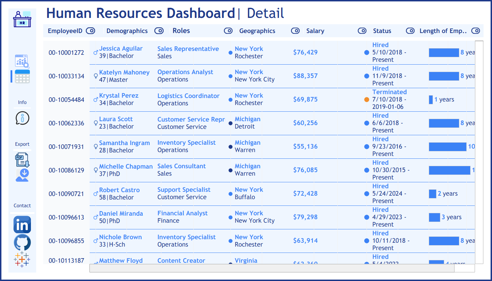

# HR Analytics Dashboard | Workforce Overview, Pay Anomalies & Retention Insights




## 1. Business Context & Project Summary

Before this project, the company's HR data was decentralized, making it hard for the management team to see the big picture of their workforce. 

This project helps the company move from guessing to making data-driven HR decisions by cleaning and visualizing a dataset of 8,950 employees in Tableau.

### Goals 
This dashboard aims to:

*   **Set Baselines:** Show the current status of the workforce.
*   **Identify Anomalies:** Point out unusual trends in turnover rate, age, and salary.
*   **Propose Next Steps:** Act as a guide to help HR solve the talent retention problem based on data.

### Data Source & Tech Stack

*   **Data Source:** A synthetic HR dataset generated using Python and the `Faker` library.
*   **Analytics Tool:** Tableau Desktop / Tableau Public.
*   **Data Logic:** Used Calculated Fields and LOD (Level of Detail) Expressions to build metrics and analyze the data.
*   **Data Visualization:** Designed an interactive UI/UX with various charts (Scatter plots, Donut charts, Bar charts, etc).
*   **Interactivity:** Built a smooth user experience using Navigation, Cross-filtering, Tooltips, and Global Filters.


---

## 2. Workforce Overview & Key Metrics

Before diving into anomalies, the dashboard establishes the basic metrics of the company from 2014 to 2026:

*   **Headcount:** 8,950 employees hired in total; 7,950 are currently working (Active).
*   **Turnover Rate:** 1,000 employees have left, making the historical turnover rate 11.1%.
*   **Location:** The company is highly centralized. 70% of the staff work at the Headquarters in New York.
*   **Demographics:** The gender ratio is quite balanced (46% Female - 54% Male). Most employees hold a Bachelor's degree.
*   **Income:** High income is concentrated in the Master's and PhD groups, indicating that education level directly impacts salary.

---

## 3. Key Findings & Anomalies

### Finding 1: Turnover Concentration in Core Operations
*   **Observation:** 70% of the workforce is located in the headquarters - New York (Rochester, Buffalo, New York City), while branches make up only 30% (mostly in Michigan). However, the turnover risk is not random; it is heavily concentrated in three main departments: Operations, Sales, and Customer Service.

*   **Insight:** The turnover risk is heavily concentrated in three core departments. A shared characteristic of the workforce in these departments is that they are mostly young (under 42) and fall into the lower salary bracket (under $80,000).

### Finding 2: The Inversion of the Gender Pay Gap at Senior Levels
*   **Observation:** For High School and Bachelor's degrees, men earn slightly more than women. However, this completely flips at the senior level, where women with Master's or PhD degrees earn about $15,000 more than men on average.

*   **Insight:** The main issue is the $15,000 gap, no matter which gender is paid more. This huge difference is abnormal. We need to find out why: is it premium pay to attract new talent, revenue-driven roles, or an unfair salary structure?

### Finding 3: High Pay for Tech Skills
*   **Observation:** Usually, older managers (42+) receive the highest pay (Finance Managers, Consultants, etc.). However, the data shows a younger group (38-42 years old) in tech roles (Software Developers, System Administrators) also reaching the top salary bands.

*   **Insight:** The company is clearly paying above standard rates to attract and retain young tech talent, valuing technical expertise as highly as traditional management tracks.

### Finding 4: Data Quality Issue in Performance Ratings
*   **Observation:** The dashboard shows that the performance rating is equally distributed across all education levels, including PhDs. 
*   **Insight:** In reality, different education levels (like PhDs vs. Bachelors) have different performance expectations, so their ratings shouldn't look exactly the same. This uniform distribution points to a bug in data processing or missing values. The Data team needs to investigate the pipeline to fix this data quality issue.

---

## 4. Strategic Recommendations

Based on the dashboard findings, here are the suggested next steps:

*   **Pay Equity Audit:** HR and Finance need to review the salaries of the Master/PhD group. They should find out why there is a $15,000 gap—whether it's due to complex job tasks, external hiring costs, or an unfair promotion process.
*   **Deep-Dive into Turnover:** Focus on the "Red Zone" (Operations, Sales, Customer Service). First, we need to verify if the high number of departures is a real retention issue or simply proportional to their large headcounts. Then, I recommend using a Machine Learning model to find the exact reasons why young employees in these departments are leaving.
*   **Dual-Career Track:** Create a clear promotion path for tech experts. They should be able to get higher pay based on their technical skills without being forced to become managers.

---

## 5. Dashboard Navigation
### Repository Structure
This project focuses on the end-user experience. The folder contains the dataset and reports:

```text
hr-analytics-dashboard/
├── data/
│   └── HR_Data_Final.csv          # Final dataset for the Dashboard
├── images/                        # Screenshots for the report
├── HR_Analytics_Dashboard.twbx    # Tableau Workbook file (Download to view offline)
└── README.md                      # Project analysis report

```
### How to use the Dashboard
To fully experience the project, please view the interactive Dashboard here: **[HR Analytics Dashboard on Tableau Public](https://public.tableau.com/views/HRAnalyticsDashboard_17805947035620/HRDashboard?:language=en-US&:sid=&:redirect=auth&:display_count=n&:origin=viz_share_link)**

The dashboard has a Left Navigation Bar to help users easily switch between features:

**1. Page Navigation:**
*   **Overview Dashboard:** Shows the big picture (Baselines, Demographics, Income).
*   **Detail Dashboard:** Shows micro-details. You can look up specific employees using deep filters (Employee ID, Role, Status, Salary Range, etc.).

**2. Sidebar Utilities:**
*   **Info (i):** A quick user guide.
*   **Export:** Export the view as a PDF or Image for presentations.
*   **Contact:** Links to my LinkedIn, GitHub, and Tableau Public.

**3. Interaction Flow:**
*   **Hover:** Hover over any chart to see detailed tooltips.
*   **Click:** Click on a department or city to cross-filter the whole dashboard.
*   **Filter:** Click the Switch icon (top right) to open the global filters.

---

## 6. Author Info & Contact

**Thai Ngoc Thanh Mai**
*Data Analyst*

Thank you for reading! If you have any questions, feedback, or want to collaborate, feel free to connect with me:

*   📧 **Email:** thaingocthanhmai@gmail.com
*   💼 **LinkedIn:** [linkedin.com/thaingocthanhmai](https://www.linkedin.com/in/thaingocthanhmai)
*   💻 **GitHub:** [github.com/data-with-thanh-mai](https://github.com/data-with-thanh-mai)
*   📊 **Tableau Public:** [public.tableau.com//thaingocthanhmai](https://public.tableau.com/app/profile/thanh.mai.thai.ngoc)

> *"Without data, you're just another person with an opinion"*
