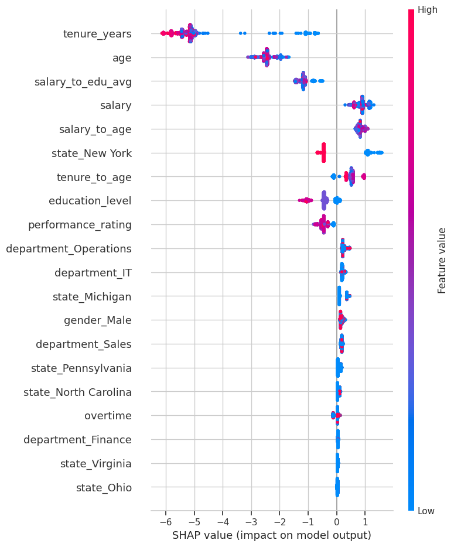
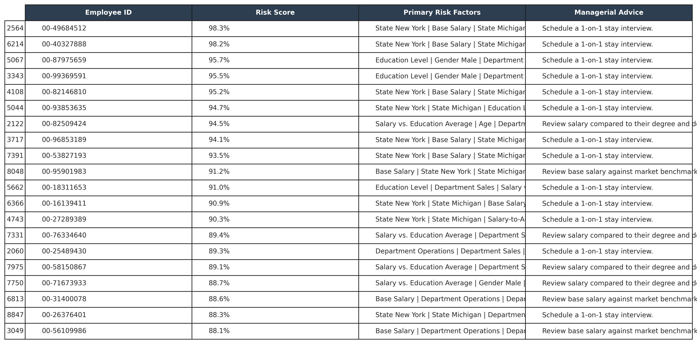

# End-to-End HR Analytics: From Descriptive Dashboard to Predictive AI

## 📑 Table of Contents

* [1. Business Context & Problem](#1-business-context--problem)
* [2. Phase 1: Descriptive Analytics & HR Dashboard](#2-phase-1-descriptive-analytics--hr-dashboard)
    * [Workforce Overview](#workforce-overview)
    * [Key Findings & Anomalies](#key-findings--anomalies)
    * [Strategic Recommendations](#strategic-recommendations)
* [3. Phase 2: Predictive AI Early Warning System](#3-phase-2-predictive-ai-early-warning-system)
    * [Strategy & Business ROI](#strategy--business-roi)
    * [Technical Approach & Results](#technical-approach--results)
    * [The Actionable Output](#the-actionable-output)
* [4. Tech Stack](#4-tech-stack)
* [5. Author Info & Contact](#5-author-info--contact
## 📸 Project Sneak Peek

### Phase 1: Descriptive HR Dashboard
*(A centralized view to monitor workforce health, pay equity, and turnover trends)*

### Phase 2: Predictive Early Warning System
*(AI-driven flight risk detection with SHAP explainability translating into actionable HR interventions)*

  
  

*(Left: SHAP values revealing root causes of attrition. Right: The automated Actionable Roster generated for HR Leaders).*

---

## 🛠 Tech Stack

**Phase 1: Descriptive Analytics**
* **Data Source & Generation:** Python (`Faker` library).
* **Analytics & Visualization:** Tableau Desktop / Tableau Public (Calculated Fields, LOD Expressions, Cross-filtering).

**Phase 2: Predictive Modeling**
* **Environment:** Jupyter Notebook.
* **Language:** Python 3.8+.
* **Data Processing & ML:** Pandas, Scikit-learn, XGBoost, imbalanced-learn (SMOTE).
* **Model Explainability:** SHAP.

---

## 1. Business Context & Problem

### **The Business Context:**
Previously, the company's HR data was highly decentralized, making it difficult for the management team to track workforce demographics, pay equity, and performance metrics. Furthermore, the organization lacked any predictive modeling capabilities to foresee employee attrition, leaving the HR department without the necessary tools to proactively retain top talent.

#### **The Initial Goal:**
The project began with the objective of building a comprehensive analytics system to provide a macroscopic overview of HR operations and generate actionable, data-driven insights.

#### **The Problem Identified (Data-Driven Discovery):**
During the exploratory data analysis (EDA) and dashboarding process, a specific, high-impact systemic issue was uncovered: a 2.45% annual turnover rate heavily concentrated in core operational departments. Losing approximately 201 employees yearly results in a talent drain costing the company ~$1 Million annually (based on the SHRM benchmark of $4,700 cost-per-hire).

### **The End-to-End Solution:**
To address both the need for general operational visibility and the specific turnover problem, this project is structured into two interconnected phases:

* **Phase 1 (Descriptive Analytics):** An interactive Tableau dashboard designed for daily operational monitoring. It provides a complete workforce overview, highlights pay anomalies, and tracks departmental trends.
* **Phase 2 (Predictive Analytics):** An ML-based Early Warning System specifically built to address the turnover issue discovered in Phase 1. It predicts employee flight risks 30-60 days in advance.

This dual approach upgrades the HR function from basic, reactive reporting to proactive workforce management:

| Feature | Traditional HR (Current State) | AI Early Warning System (Phase 2 Output) |
| :--- | :--- | :--- |
| **Approach** | **Reactive:** Intervenes only after red flags appear. | **Proactive:** Flags potential risks 30-60 days in advance. |
| **Assessment** | Manager's intuition and lagging indicators. | Objective data (Salary, Age, Tenure, Performance). |
| **Scalability** | Low: Limited to manual observation. | **High:** Scans 8,000+ employees in seconds. |
| **Insights** | Surface-level behavioral issues. | **SHAP Analysis:** Pinpoints the exact drivers of attrition. |

---

## 2. Phase 1: Descriptive Analytics & HR Dashboard

*For full details, please refer to the `01_hr_dashboard_analysis/` directory.*

The first phase of the project aims to set baselines, identify anomalies in turnover and salary, and propose data-driven next steps.

### Workforce Overview
* **Headcount & Turnover:** The company has hired 8,950 employees in total, with 7,950 currently active. Historically, 1,000 employees have left, resulting in an 11.1% historical turnover rate.
* **Demographics & Location:** The workforce is centralized, with 70% of staff working at the New York Headquarters. The gender ratio is balanced (46% Female to 54% Male), and most employees hold a Bachelor's degree.

### Key Findings & Anomalies
* **Turnover Concentration:** Turnover is not random; it is heavily concentrated in Operations, Sales, and Customer Service among young employees (under 42) earning under $80,000.
* **Gender Pay Gap Inversion:** At senior levels, women with Master's or PhD degrees earn an abnormal average of $15,000 more than men.
* **High Pay for Tech Skills:** Younger employees (38-42 years old) in tech roles are reaching the top salary bands, indicating the company pays premium rates to retain tech talent.
* **Data Quality Issues:** Performance ratings are equally distributed across all education levels, pointing to a potential bug in data processing that needs pipeline investigation.

**Strategic Recommendations:** Conduct a pay equity audit for the Master/PhD group, create a dual-career track for tech experts, and utilize Machine Learning to deep-dive into the turnover reasons in the core operations departments.

---

## 3. Phase 2: Predictive AI Early Warning System

*For technical implementations, please refer to the `02_hr_flight_risk_model/HR_Flight_Risk_Prediction.ipynb` notebook.*

Following the dashboard's recommendation, Phase 2 implements a Machine Learning model to detect flight risks objectively. 

### Strategy & Business ROI
The project applies a Cost Matrix strategy based on 1,000 instances of attrition:
* **Cost of Missing a risk:** ~$5,000 per person in replacement costs.
* **Cost of False Alarm:** ~$500 per person for HR check-ins.

Because missing a flight risk is ten times more costly than a false alarm, the model optimizes for Recall and F1-Score. **Business Target:** Retaining just 20% of the high-risk core talent (about 40 people/year) will directly save the company $188,000 annually.

### Technical Approach & Results
* **Handling Data:** SMOTE was applied to oversample the minority class (2.45% attrition rate) to prevent majority bias.
* **Algorithm & Tuning:** XGBoost was selected as the champion model with a baseline AUC-ROC of 0.91. Hyperparameters were fine-tuned using Grid Search (`learning_rate: 0.1`, `max_depth: 6`, `scale_pos_weight: 3`) to maximize early detection.
* **Performance Metrics:** The final model correctly classifies 92% of all profiles (Overall Accuracy). It successfully identifies 73% of employees planning to leave (Recall) with a 62% Precision rate, resulting in an optimal F1-Score of 0.67. 

### The Actionable Output
The system generates an automated CSV file (`HR_Retention_Alerts_2026_06.csv`) designed to be exported monthly or integrated into BI Web Dashboards. This roster translates AI probabilities and SHAP explanations into personalized business interventions:

| Employee ID | Risk Score | Top Driving Factors (via SHAP) | Actionable Advice |
| :--- | :--- | :--- | :--- |
| **00-66691738** | 91.6% | 1. Salary vs. Edu Average   2. Dept: Sales   3. Dept: Operations | Review salary compared to their degree and department avg. |
| **00-49684512** | 91.0% | 1. Location (New York)   2. Base Salary   3. Location (Michigan) | Check local market competitiveness in New York. |
| **00-19976458** | 90.4% | 1. Tenure-to-Age Ratio   2. Location (New York)   3. Education Level | Discuss career progression path; Identify if they feel "stuck". |

---

## 📞 Author Info & Contact
**Thai Ngoc Thanh Mai**
*Data Analyst*

Thank you for reading! If you have any questions, feedback, or want to collaborate, feel free to connect with me:

*   📧 **Email:** thaingocthanhmai@gmail.com
*   💼 **LinkedIn:** [linkedin.com/thaingocthanhmai](https://www.linkedin.com/in/thaingocthanhmai)
*   💻 **GitHub:** [github.com/data-with-thanh-mai](https://github.com/data-with-thanh-mai)
*   📊 **Tableau Public:** [public.tableau.com//thaingocthanhmai](https://public.tableau.com/app/profile/thanh.mai.thai.ngoc)

> *"Without data, you're just another person with an opinion."*

